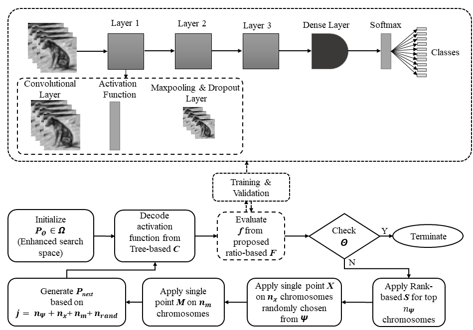

## Activation Function Optimization Scheme for Image Classification

### Abstract

Activation function has a significant impact on the dynamics, convergence, and performance of deep neural networks. The search for a consistent and high-performing activation function has always been a pursuit during deep learning model development.

Existing state-of-the-art activation functions are manually designed with human expertise, except for Swish. Swish was developed using a reinforcement learning-based search strategy.

In this study, we propose an evolutionary approach for optimizing activation functions specifically for image classification tasks, aiming to discover functions that outperform current state-of-the-art options. Through this optimization framework, we obtain a series of high-performing activation functions denoted as Exponential Error Linear Unit (EELU).

The developed activation functions are evaluated for image classification tasks from two perspectives:

Five state-of-the-art neural network architectures: ResNet50, AlexNet, VGG16, MobileNet, and Compact Convolutional Transformer, covering computationally heavy to light neural networks.
Eight standard datasets: CIFAR10, Imagenette, MNIST, Fashion MNIST, Beans, Colorectal Histology, CottonWeedID15, and TinyImageNet, covering typical machine vision benchmarks, agricultural image applications, and medical image applications.
Finally, we statistically investigate the generalization of the resultant activation functions developed through the optimization scheme. With a Friedman test, we conclude that the optimization scheme is able to generate activation functions that outperform the existing standard ones in 92.8% of cases among 28 different cases studied, and -x * erf(e^{-x}) is found to be the best activation function for image classification generated by the optimization scheme.
 


### Installation
```
git clone https://github.com/abdurrahman1828/AFOS.git
cd AFOS
pip install -r requirments.txt
pip install -e .
```

### Scripts
* `activation.py` includes the basic functions used to generate new activation functions 
* `fitness.py` defined the fitness function of GA 
* `ga_utils.py` includes utility functions for GA 
* `utils.py` includes other utility function
* `relu_benchmark` can be used for benchmarking with `ReLU` activation function
